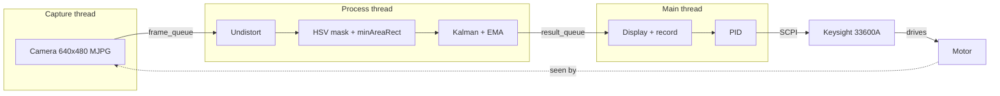

<div align="center">

# Visual Servo Control for a Piezoelectric Ultrasonic Motor

A 120 FPS camera tracks the motor. A Keysight 33600A function generator drives it, and a PID loop closes the gap between them.

**English** · [繁體中文](README.zh-TW.md)


</div>

## Highlights

- Tracks at **120 FPS** using three threads (capture, process, display), with a per-frame processing P99 of **3.6 ms** against an 8.3 ms budget
- Switches drive modes in **under 2 ms** with compound SCPI commands, more than 600x faster than re-uploading the waveforms
- Uses **PID heading control** to hold a straight line or stop at a target angle
- Applies **TPS lens undistortion**, so positions stay accurate out to the edges of a wide-angle lens
- Exports a tracked video, a raw video, a CSV and plots for every run

## How it works



## Quick start

```bash
pip install -r requirements.txt
python main.py
```

Before you run it, set `CAMERA_INDEX`, `MODE` (`straight` / `rotation`) and `FG_RESOURCE_STRING` in `config.py`. All other parameters are documented in the same file.

| Key | Action |
|---|---|
| `Space` | Start / stop recording |
| `1` / `2` / `3` / `4` | Forward / Right / Backward / Left |
| `0` | Output off |
| `Q` / `Esc` | Quit and save |

<details>
<summary>Output files</summary>

```
YYYYMMDD_HHMMSS_<mode>_<voltage>/
├── camera_<mode>_tracked.mp4        # annotated video
├── camera_<mode>_raw.mp4            # raw video
├── camera_<mode>_pos_angle_speed.csv
├── camera_<mode>_position.png
└── camera_<mode>composite.png       # 8 time points in one image
```

CSV columns: `t_s`, `x_mm`, `y_mm`, `angle_deg_unwrapped`, `speed_mm_s`, `angular_vel_dps` and more.
</details>

## Results

With heading control, the motor goes straight. Without it, the motor drifts about 10°.


For the full latency and throughput tests, see [`benchmarks/benchmark_summary_report.txt`](benchmarks/benchmark_summary_report.txt).

## Project structure

| Path | Contents |
|---|---|
| `main.py` | Entry point and main loop |
| `config.py` | All tunable parameters |
| `camera_threads.py` | Capture and process threads |
| `image_processing.py` · `signal_processing.py` | Detection, Kalman filter, EMA |
| `function_generator.py` · `pid_controller.py` | SCPI control and PID |
| `calibration/` | TPS undistortion map and tools |
| `benchmarks/` | Latency and throughput tests |
| `experiment_*/` · `data analysis (*)/` | Recorded runs and analysis |
