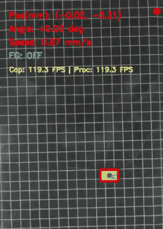
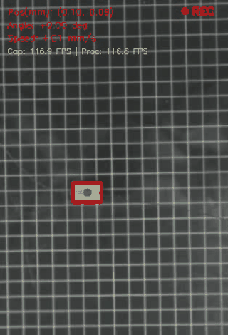
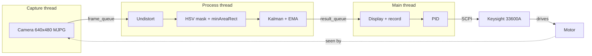
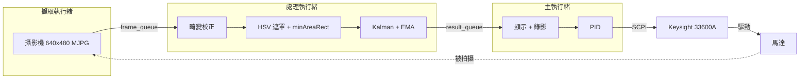

<div align="center">

# Visual Servo Control for a Piezoelectric Ultrasonic Motor

A 120 FPS camera tracks the motor. A Keysight 33600A function generator drives it, and a PID loop closes the gap between them.

[Project page on floraliu.dev](https://floraliu.dev/work/piezo-motor)




</div>

<details open>
<summary><b>English</b></summary>

## Highlights

- Tracks at **120 FPS** using three threads (capture, process, display), with a per-frame processing P99 of **3.6 ms** against an 8.3 ms budget
- Switches drive modes in **under 2 ms** with compound SCPI commands, more than 600x faster than re-uploading the waveforms
- Uses **PID heading control** to hold a straight line or stop at a target angle
- Applies **TPS lens undistortion**, so positions stay accurate out to the edges of a wide-angle lens
- Exports a tracked video, a raw video, a CSV and plots for every run

## How it works



## Quick start

```bash
pip install -r requirements.txt
python main.py
```

Before you run it, set `CAMERA_INDEX`, `MODE` (`straight` / `rotation`) and `FG_RESOURCE_STRING` in `config.py`. All other parameters are documented in the same file.

| Key | Action |
|---|---|
| `Space` | Start / stop recording |
| `1` / `2` / `3` / `4` | Forward / Right / Backward / Left |
| `0` | Output off |
| `Q` / `Esc` | Quit and save |

<details>
<summary>Output files</summary>

```
YYYYMMDD_HHMMSS_<mode>_<voltage>/
├── camera_<mode>_tracked.mp4        # annotated video
├── camera_<mode>_raw.mp4            # raw video
├── camera_<mode>_pos_angle_speed.csv
├── camera_<mode>_position.png
└── camera_<mode>composite.png       # 8 time points in one image
```

CSV columns: `t_s`, `x_mm`, `y_mm`, `angle_deg_unwrapped`, `speed_mm_s`, `angular_vel_dps` and more.
</details>

## Results

With heading control, the motor goes straight. Without it, the motor drifts about 10°.


For the full latency and throughput tests, see [`benchmarks/benchmark_summary_report.txt`](benchmarks/benchmark_summary_report.txt).

## Project structure

| Path | Contents |
|---|---|
| `main.py` | Entry point and main loop |
| `config.py` | All tunable parameters |
| `camera_threads.py` | Capture and process threads |
| `image_processing.py` · `signal_processing.py` | Detection, Kalman filter, EMA |
| `function_generator.py` · `pid_controller.py` | SCPI control and PID |
| `calibration/` | TPS undistortion map and tools |
| `benchmarks/` | Latency and throughput tests |
| `experiment_*/` · `data analysis (*)/` | Recorded runs and analysis |

## Related repos

| Repo | Role |
|---|---|
| [Keysight-33600A-SCPI-programming](https://github.com/liu092111/Keysight-33600A-SCPI-programming) | Standalone SCPI waveform controller and Teensy firmware |
| [AD9106_SRAM-function](https://github.com/liu092111/AD9106_SRAM-function) | Teensy driver for the AD9106 DAC, a compact drive option |


</details>

<details>
<summary><b>繁體中文</b></summary>

用 120 FPS 攝影機追蹤馬達、用 Keysight 33600A 函數產生器驅動，再以 PID 形成閉迴路控制。

## 重點

- 以三執行緒（擷取、處理、顯示）達到 **120 FPS** 追蹤，單幀處理 P99 為 **3.6 ms**，低於 8.3 ms 的時間預算
- 以 compound SCPI 指令切換驅動模式，**不到 2 ms**，比重新上傳波形快 600 倍以上
- 以 **PID 方向控制**保持直線前進，或旋轉到目標角度後停止
- 以 **TPS 鏡頭畸變校正**處理廣角鏡頭，影像邊緣的位置也準確
- 每次實驗都會輸出追蹤影片、原始影片、CSV 和圖表

## 運作流程



## 快速開始

```bash
pip install -r requirements.txt
python main.py
```

執行前，先在 `config.py` 設定 `CAMERA_INDEX`、`MODE`（`straight` / `rotation`）和 `FG_RESOURCE_STRING`。其他參數的說明也都寫在這個檔案裡。

| 按鍵 | 動作 |
|---|---|
| `Space` | 開始 / 停止錄影 |
| `1` / `2` / `3` / `4` | 前進 / 右轉 / 後退 / 左轉 |
| `0` | 關閉輸出 |
| `Q` / `Esc` | 結束並存檔 |

<details>
<summary>輸出檔案</summary>

```
YYYYMMDD_HHMMSS_<mode>_<voltage>/
├── camera_<mode>_tracked.mp4        # 標註影片
├── camera_<mode>_raw.mp4            # 原始影片
├── camera_<mode>_pos_angle_speed.csv
├── camera_<mode>_position.png
└── camera_<mode>composite.png       # 8 個時間點合成圖
```

CSV 欄位包含 `t_s`、`x_mm`、`y_mm`、`angle_deg_unwrapped`、`speed_mm_s`、`angular_vel_dps` 等。
</details>

## 成果

加上方向控制後，馬達能走直線；沒有控制時，會偏移約 10°。


完整的延遲與吞吐量測試結果，請見 [`benchmarks/benchmark_summary_report.txt`](benchmarks/benchmark_summary_report.txt)。

## 專案結構

| 路徑 | 內容 |
|---|---|
| `main.py` | 程式進入點與主迴圈 |
| `config.py` | 所有可調參數 |
| `camera_threads.py` | 擷取與處理執行緒 |
| `image_processing.py` · `signal_processing.py` | 目標偵測、Kalman 濾波、EMA |
| `function_generator.py` · `pid_controller.py` | SCPI 控制與 PID |
| `calibration/` | TPS 校正映射表與工具 |
| `benchmarks/` | 延遲與吞吐量測試 |
| `experiment_*/` · `data analysis (*)/` | 實驗紀錄與分析 |

## 相關 repo

| Repo | 角色 |
|---|---|
| [Keysight-33600A-SCPI-programming](https://github.com/liu092111/Keysight-33600A-SCPI-programming) | 獨立的 SCPI 波形控制器與 Teensy 韌體 |
| [AD9106_SRAM-function](https://github.com/liu092111/AD9106_SRAM-function) | AD9106 DAC 的 Teensy 驅動程式，是更精簡的驅動方案 |

</details>
