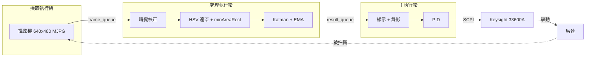

<div align="center">

# 壓電超音波馬達視覺伺服控制

用 120 FPS 攝影機追蹤馬達、用 Keysight 33600A 函數產生器驅動，再以 PID 形成閉迴路控制。

[English](README.md) · **繁體中文**


</div>

## 重點

- 以三執行緒（擷取、處理、顯示）達到 **120 FPS** 追蹤，單幀處理 P99 為 **3.6 ms**，低於 8.3 ms 的時間預算
- 以 compound SCPI 指令切換驅動模式，**不到 2 ms**，比重新上傳波形快 600 倍以上
- 以 **PID 方向控制**保持直線前進，或旋轉到目標角度後停止
- 以 **TPS 鏡頭畸變校正**處理廣角鏡頭，影像邊緣的位置也準確
- 每次實驗都會輸出追蹤影片、原始影片、CSV 和圖表

## 運作流程



## 快速開始

```bash
pip install -r requirements.txt
python main.py
```

執行前，先在 `config.py` 設定 `CAMERA_INDEX`、`MODE`（`straight` / `rotation`）和 `FG_RESOURCE_STRING`。其他參數的說明也都寫在這個檔案裡。

| 按鍵 | 動作 |
|---|---|
| `Space` | 開始 / 停止錄影 |
| `1` / `2` / `3` / `4` | 前進 / 右轉 / 後退 / 左轉 |
| `0` | 關閉輸出 |
| `Q` / `Esc` | 結束並存檔 |

<details>
<summary>輸出檔案</summary>

```
YYYYMMDD_HHMMSS_<mode>_<voltage>/
├── camera_<mode>_tracked.mp4        # 標註影片
├── camera_<mode>_raw.mp4            # 原始影片
├── camera_<mode>_pos_angle_speed.csv
├── camera_<mode>_position.png
└── camera_<mode>composite.png       # 8 個時間點合成圖
```

CSV 欄位包含 `t_s`、`x_mm`、`y_mm`、`angle_deg_unwrapped`、`speed_mm_s`、`angular_vel_dps` 等。
</details>

## 成果

加上方向控制後，馬達能走直線；沒有控制時，會偏移約 10°。


完整的延遲與吞吐量測試結果，請見 [`benchmarks/benchmark_summary_report.txt`](benchmarks/benchmark_summary_report.txt)。

## 專案結構

| 路徑 | 內容 |
|---|---|
| `main.py` | 程式進入點與主迴圈 |
| `config.py` | 所有可調參數 |
| `camera_threads.py` | 擷取與處理執行緒 |
| `image_processing.py` · `signal_processing.py` | 目標偵測、Kalman 濾波、EMA |
| `function_generator.py` · `pid_controller.py` | SCPI 控制與 PID |
| `calibration/` | TPS 校正映射表與工具 |
| `benchmarks/` | 延遲與吞吐量測試 |
| `experiment_*/` · `data analysis (*)/` | 實驗紀錄與分析 |
